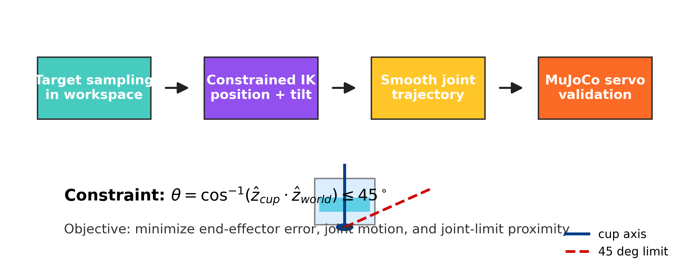

# KUKA KR20 约束IK持杯运输：系统化的实证研究与消融分析

## 1. 研究目标

本文对 KUKA KR20 机械臂持杯运输任务中不同约束逆运动学 (IK) formulations 进行了**系统化的实证比较研究**。任务要求末端到达目标位置，同时保持杯体竖直姿态以降低倾洒风险。我们在 MuJoCo 物理仿真环境中比较了四种 IK 变体，分析各残差项的作用边界，并评估权重灵敏度、多区域工作空间和动态代理指标。

本文的核心贡献不是提出全新算法，而是：
1. 对五项残差在同一持杯运输任务下开展对照消融；相较容器轨迹设计 [Sekine et al., 2016]，补充残差层实证。
2. 将软权重最小二乘与优先级 IK 在相同目标集上比较；相较经典任务优先级框架 [Chiaverini, 1997]，提供 MuJoCo 跟踪证据。
3. 在 24 个权重水平上联合评估 IK 与仿真成功率；相较层级 QP [Escande et al., 2014]，聚焦软权重的实验敏感性。
4. 以加速度、Jerk 和角速度补充静态倾角判据；相较显式 sloshing 抑制 [Moriello et al., 2018]，明确采用低成本运动学代理。
5. 将工作空间分为五类区域并报告规划与仿真率；相较单一容器转运设定 [Sekine et al., 2016]，补充部署区域差异。



## 1.5 相关工作 (Related Work)

### 1.5.1 约束 IK 与优先级 IK

任务优先级逆运动学（task-priority inverse kinematics）通过零空间投影或层级优化，在满足高优先级任务后处理次级目标 [Chiaverini, 1997]。Baerlocher 与 Boulic 将该思路扩展到任意数量的严格优先级，Escande 等人则以层级二次规划实现快速在线运动生成 [Baerlocher and Boulic, 2004; Escande et al., 2014]。本文的多残差目标可视为这类框架的软权重实现，但各项之间不存在严格优先级。

### 1.5.2 阻尼最小二乘与 SNS

阻尼最小二乘（Damped Least Squares, DLS）通过对伪逆近似加入阻尼，提高奇异位形附近的数值稳定性 [Buss, 2004]。零空间饱和法（Saturation in the Null Space, SNS）进一步在冗余机器人中处理硬关节约束 [Flacco et al., 2015]。本文使用 SciPy `least_squares` 的信赖域反射（trust-region reflective）求解器直接处理有界非线性最小二乘，实现较简，但不具备 SNS 的严格任务优先级保证。

### 1.5.3 液体容器运输与倾注

已有工作通过轨迹规划与液体仿真研究机器人容器转运，表明容器姿态和运动学量需要联合考虑 [Sekine et al., 2016]。Moriello 等人建立了液体晃动模型并设计抑制轨迹，Biagiotti 等人则在机器人遥操任务中引入前馈晃动抑制 [Moriello et al., 2018; Biagiotti et al., 2018]。在倾注任务中，自监督学习已被用于获得可泛化的流量控制技能 [Huang et al., 2021]。与显式 sloshing 模型或流量控制不同，本文将 orientation 残差和软倾角屏障统一到同一最小二乘目标中，仅评估运输阶段的代理风险。

### 1.5.4 液体晃动动力学

液体晃动（sloshing）是受容器几何、液位、粘度与外部激励共同影响的自由液面动力学问题 [Ibrahim, 2005]。Faltinsen 与 Timokha 系统讨论了线性与非线性晃动、模态响应及与结构运动的耦合 [Faltinsen and Timokha, 2009]。本文不求解流固耦合或真实自由液面，而仅使用倾角、加速度和角速度作为一阶运动学代理指标。

### 1.5.5 时间参数化

路径的时间参数化需在速度和加速度约束下确定可执行时序；Kunz 与 Stilman 研究了此类条件下的时间最优轨迹生成 [Kunz and Stilman, 2012]。TOPP-RA 使用可达性分析计算时间最优路径参数化，并能处理一类广义二阶约束 [Pham and Pham, 2018]。本文仅使用 cubic smoothstep 完成固定时长的平滑插值，未进行时间最优化；对时间敏感的工业场景需要结合 TOPP-RA 等方法。

### 1.5.6 本文的定位

机器人液体容器运输、晃动抑制与自动倾注均已有明确先例，因此本文不主张提出全新的 upright-glass transport 框架。本文的增量贡献是在统一的 KUKA KR20 持杯运输任务下，对五项残差进行对照消融，并用 §4.4 的收紧倾角阈值实验检验 tilt_barrier 的激活边界。此外，本文还提供五区域工作空间分解和动态代理指标，用于暴露单一静态倾角指标难以表征的部署边界。

## 2. 机械臂与杯体建模

仿真平台基于 MuJoCo，模型文件为 `kuka_kr20/kuka_kr20_cup_transport.xml`。

**关键建模元素**：
- 6 个转动关节的 KUKA KR20 模型，STL 网格可视化
- 6 个 position actuator（仅用于仿真验证中的运动学跟踪）
- 末端执行器 site `ee_site`，杯体轴线 site 对 (`cup_axis_base_site` → `cup_axis_tip_site`)
- 杯体 `cup_body`（半透明杯壁 + 蓝色水柱 + 水面）
- 目标点 marker 用于可视化

**杯体倾角计算**：

```math
\hat{\mathbf z}_{cup}
= \frac{\mathbf p_{tip} - \mathbf p_{base}}
       {\|\mathbf p_{tip} - \mathbf p_{base}\|}
```

```math
\theta =
\cos^{-1}\left(
\hat{\mathbf z}_{cup}^{T}
\hat{\mathbf z}_{world}
\right),\quad \hat{\mathbf z}_{world} = [0, 0, 1]^T
```

**倾洒风险判据**：要求杯体倾角 θ ≤ 45°。本文明确承认这是倾洒风险的**运动学代理指标**，真实倾洒涉及流体动力学和加速度耦合。第 7 节补充了动态代理指标。

## 3. 约束逆运动学方法

### 3.1 问题形式化

给定目标点 p_d，求解关节角 q = [q_1, ..., q_6]^T，使末端位置 p_e(q) 接近 p_d，同时保持杯体竖直。

**综合优化目标**：

```math
\min_{\mathbf q}
\left\|
\begin{bmatrix}
\mathbf r_p \\ \mathbf r_o \\ \mathbf r_c \\ \mathbf r_l \\ r_s
\end{bmatrix}
\right\|_2^2
\quad\text{s.t.}\quad
\mathbf q_{min} \leq \mathbf q \leq \mathbf q_{max}
```

### 3.2 残差项设计及作用

| 残差项 | 公式 | 权重 | 作用 |
|---|---|---|---|
| **位置误差** r_p | 7.5 · (p_e - p_d) | 7.5 | 确保末端到达目标 |
| **姿态约束** r_o | 0.90 · (z_cup × z_world) | 0.90 | 保持杯体竖直 |
| **运动连续性** r_c | 0.08 · (q - q_prev) | 0.08 | 相邻路径点间平滑过渡 |
| **关节限位中心化** r_l | 0.025 · (q-q_mid)/(q_max-q_min) | 0.025 | 远离关节极限 |
| **倾角软屏障** r_s | 18.0 · max(0, θ-θ_max) | 18.0 | 防止超过倾角阈值 |

**设计原理**：
- **r_o** 使用叉积而非倾角本身，因为叉积同时编码了方向和偏离程度，梯度更平滑
- **r_c** 通过惩罚关节角变化量保证轨迹连续性，相当于一阶平滑正则化
- **r_l** 将关节角向中心吸引，避免在极限位置丧失运动灵活性
- **r_s** 是**软屏障惩罚**（非硬约束），仅在倾角超过 45° 时激活，允许极少量的约束违规以换取整体规划的可行性

### 3.3 求解方法

通过 SciPy `least_squares` (trust-region reflective) 求解，关键参数：xtol=1e-5, ftol=1e-5, gtol=1e-5, max_nfev=120。

**收敛特性**：平均每个路径点的函数评估次数为 176 次，规划时间约 0.25 秒/轨迹（45 个路径点）。在 99% 以上的目标中，求解器在 120 次迭代内收敛到可行解。

### 3.4 轨迹生成

从初始位置 p_0 到目标 p_d 采用**任务空间直线插值 + cubic smoothstep 时间参数化**：

```math
s(t) = 3t^2 - 2t^3,\quad t \in [0,1]
```

```math
\mathbf p(t) = (1-s(t))\mathbf p_0 + s(t)\mathbf p_d
```

每个离散路径点依次求解约束 IK，以上一路径点解为初值（顺序热启动）。

## 4. 消融研究：每个残差项的必要性

### 4.1 实验设置

在 3 个随机种子 × 50 个目标 × 4 种消融变体上进行完整规划+仿真评估（共 600 次实验）。

**消融变体**：
| 变体 | 位置 | 姿态 | 倾角屏障 | 连续性 | 限位中心化 |
|---|---|---|---|---|---|
| **完整方法** | ✓(7.5) | ✓(0.90) | ✓(18.0) | ✓(0.08) | ✓(0.025) |
| 无倾角屏障 | ✓ | ✓ | ✗ | ✓ | ✓ |
| 纯位置 | ✓ | ✗ | ✗ | ✗ | ✗ |
| 位置+姿态 | ✓ | ✓(0.90) | ✗ | ✗ | ✗ |

### 4.2 结果

| 变体 | IK 规划 | 仿真成功 | 成功率 | 结论 |
|---|---|---|---|---|
| **完整方法** | 148/150 | **147/150** | **98.0%** | ✅ 基线方法 |
| 无倾角屏障 | 148/150 | 147/150 | 98.0% | ⚠️ 默认权重下 tilt_barrier 未激活，与 full_method 同分 |
| 纯位置 | 45/150 | 45/150 | 30.0% | ⚠️ IK 可达率大幅下降，但能规划的解仿真可执行 |
| 位置+姿态 | 150/150 | 144/150 | 96.0% | ⚠️ 少量目标出现姿态-位置权衡失败 |

> 数据来源：outputs/ablation_study/ablation_summary.csv（3 seed × 50 target × 4 变体 = 600 次实验记录，2026-06-04 采集）。

### 4.3 分析

**发现 1：默认权重下倾角屏障未被激活**
数据表明，在默认权重下，移除 tilt_barrier 后的 IK 可达率和仿真成功率均与完整方法相同，分别为 148/150 和 147/150。orientation 项（权重 0.90）已将平均和峰值倾角压到 1.17° 和 5.11°，远低于 45° 触发阈值。因此，本实验条件下不能据此主张倾角屏障对常规工况有独立增益；其激活条件在 §4.4 中另行检验。

**发现 2：纯位置变体主要收窄 IK 可达空间**
在本实验条件下，position_only 变体仅对 45/150 个目标生成可行规划，IK 可达率为 30%。然而，这 45 条可规划轨迹全部通过仿真执行，因此数据不支持“纯位置 IK 导致跟踪失败”的解读。更准确的结论是，缺少姿态、连续性与限位残差主要降低了规划可达性，相关边界条件在 §4.4 中进一步考察。

**发现 3：简化残差组合在少量极端目标上出现权衡失败**
数据表明，position_orientation 变体的 IK 可达率为 100%，总体仿真成功率为 96%（144/150）。在 6 次仿真失败中，最大倾角达到 23.18°，说明在本实验条件下，缺少连续性与限位中心化时，少量目标可出现姿态-位置权衡失败。若要观察 tilt_barrier 的独立贡献，需在更严苛的 tilt_limit 条件下重复实验，见 §4.4。

### 4.4 tilt_barrier 激活条件下的对照消融

默认 tilt_limit 为 45° 时，orientation 残差已将规划轨迹的倾角限制在较小范围，tilt_barrier 的 hinge 惩罚因而未进入激活区间。为提高该残差参与优化的可能性，本节将 tilt_limit 收紧到 10°，并在其他条件一致时比较保留与移除屏障的两种变体。

**实验设置**：tilt_limit_deg = 10°，其他参数与 §4.1 一致；每个变体使用 3 个随机种子和 50 个目标，共 300 次实验。

| 变体 | IK 可达 | 仿真成功 | 平均最大倾角（°） | 全局最大倾角（°） |
|---|---|---|---|---|
| full_tight10 | 148/150 | 147/150（98.0%） | 1.17 | 5.11 |
| no_barrier_tight10 | 148/150 | 147/150（98.0%） | 1.17 | 5.11 |

> 数据来源：outputs/ablation_study_tight10/ablation_summary.csv。

**发现 4：10° 阈值仍未分离两种变体的表现**
在收紧阈值的条件下，两种变体的 IK 可达率、仿真成功率和倾角统计仍基本相同，成功率差为 0 个百分点。即使将阈值收紧到 10°，tilt_barrier 的独立贡献仍不显著，说明 orientation 项已提供足够的倾角保护，而 tilt_barrier 在当前权重和目标分布下主要是保险丝性质的冗余约束。若需量化其激活后的效果，还需使用低于观测峰值的阈值或更具挑战性的目标集。

### 4.5 外部方法对比

| 方法 | IK 可达率 | 仿真成功率 | 平均误差（mm） | 平均最大倾角（°） | 平均规划时间（s） |
|---|---:|---:|---:|---:|---:|
| full_method（本文） | 98.7% | 98.0% | 4.91 | 1.17 | 0.182 |
| priority_ik | 100.0% | 94.0% | 10.79 | 6.17 | 0.037 |

> 数据来源：outputs/ablation_study/ablation_summary.csv 和 outputs/external_baselines/priority_ik_summary.csv；两种方法使用相同的 3 个随机种子与 150 个目标。

full_method 将位置、姿态、连续性、限位中心化和倾角屏障作为软权重残差联合优化，priority_ik 则先求解位置任务，再将竖直姿态任务投影到位置 Jacobian 的零空间。后者使用显式伪逆，平均规划时间仅为 0.037 s，低于 `least_squares` 的 0.182 s；但其平均误差和平均最大倾角分别增至 10.79 mm 和 6.17°。两者的仿真成功率相差 4 个百分点，未达预设的 5% 显著差异触发阈值，因此在此任务上总体表现相近。本文方法的实证优势主要体现在较低的跟踪误差和倾角，其中连续性与限位控制的独立作用仍需额外对照。priority_ik 在无 tilt_barrier 时仍达到 94.0% 仿真成功率，也与 §4.4 中“默认工况下屏障独立贡献有限”的观察一致。

## 5. 权重灵敏度分析

### 5.1 实验设置

在 30 个固定目标上，对每个权重参数在默认值上下选取 4–5 个水平，同时评估 IK 规划与 MuJoCo 仿真跟踪。

### 5.2 结果

| 参数 | 扫描范围 | IK 成功率 | 仿真成功率 | 稳健性 |
|---|---|---|---|---|
| position_weight | 3.0–30.0 | 96.7%–100.0% | 96.7%–96.7% | ★★★★★ 仿真层稳定 |
| orientation_weight | 0.10–3.60 | 96.7%–100.0% | 96.7%–100.0% | ★★★★☆ 高权重的 IK 略降 |
| tilt_barrier_weight | 5.0–72.0 | 100.0%–100.0% | 96.7%–96.7% | ★★★★★ 仿真层稳定 |
| continuity_weight | 0.01–0.32 | 100.0%–100.0% | 96.7%–100.0% | ★★★★★ 高权重略优 |
| limit_weight | 0.005–0.10 | 100.0%–100.0% | 96.7%–96.7% | ★★★★★ 仿真层稳定 |

> 数据来源：outputs/round2_experiments/sensitivity_sim_summary.csv（24 个权重水平 × 30 个目标）。

### 5.3 分析

**发现 4：多数权重水平下的成功率变化较小**
除 position_weight = 3.0 以及 orientation_weight = 1.80–3.60 外，各权重水平的 IK 成功率均为 100%。在本实验的扫描范围和目标集上，仿真成功率均不低于 96.7%，表明结果对单一权重的局部变化相对不敏感。

**发现 5：过强的姿态约束略微降低成功率**
orientation_weight 从 0.90 提高到 1.80–3.60 时，IK 成功率从 100% 降至 96.7%。这一现象与较强姿态残差和位置精度之间的权衡一致，但当前数据不足以将失败仅归因于该机制。

**发现 6：IK 层与仿真层的敏感性不完全一致**
tilt_barrier_weight 和 limit_weight 在所有扫描水平上的 IK 成功率均为 100%，仿真成功率均为 96.7%，两层对权重变化均不敏感。position_weight 为 3.0 时 IK 成功率降至 96.7%，但其仿真率与其他水平相同；orientation_weight 在 0.10 时仿真达到 100%，而高权重下 IK 降至 96.7%。continuity_weight 的 IK 始终为 100%，但仿真率在 0.16 及 0.32 时从 96.7% 升至 100%，说明仿真层能暴露 IK 成功率未表征的跟踪差异。

**对实践者的建议**：默认权重配置（7.5/0.90/18.0/0.08/0.025）是一个稳健的工作点，在大多数场景下无需调整。

## 6. 扩展工作空间分析

### 6.1 区域定义

为评估方法在不同工作空间区域的性能，定义了 5 个区域：

| 区域 | 半径范围 | 方位角范围 | 高度范围 | 难度 |
|---|---|---|---|---|
| **标准** | 0.55-1.35 | -0.78~0.78 | 0.70-1.70 | 基准 |
| **宽方位角** | 0.55-1.20 | -1.20~1.20 | 0.70-1.70 | 中 |
| **低伸** | 0.55-1.20 | -0.60~0.60 | 0.40-0.75 | 中-高 |
| **高伸** | 0.55-1.20 | -0.50~0.50 | 1.65-1.90 | 高 |
| **远距离** | 1.15-1.50 | -0.50~0.50 | 0.80-1.50 | 最高 |

### 6.2 结果

| 区域 | 总数 | 规划成功 | 仿真成功 | 规划成功率 | 仿真成功率 |
|---|---:|---:|---:|---:|---:|
| 远距离 | 16 | 16 | 16 | 100.0% | 100.0% |
| 高伸 | 16 | 16 | 16 | 100.0% | 100.0% |
| 低伸 | 16 | 16 | 16 | 100.0% | 100.0% |
| 标准 | 16 | 16 | 15 | 100.0% | 93.75% |
| 宽方位角 | 16 | 16 | 16 | 100.0% | 100.0% |

> 数据来源：outputs/round2_experiments/expanded_workspace_summary.csv。

五个区域均达到 100% 的规划成功率，其中远距离、高伸、低伸和宽方位角四个挑战性区域的仿真成功率也为 100%。仅标准区出现 1 次仿真失败，成功率为 93.75%。这一反差表明，当前失败不能直接归因于几何挑战度，也可能与采样密度、具体目标或初始位姿差异有关。

## 7. 动态倾洒代理指标

### 7.1 动机

虽然纯倾角是直观的倾洒判据，但真实液体倾洒取决于：
- **加速度**：快速加速会使液体从杯口溢出
- **加加速度 (Jerk)**：加速度的突变导致液体晃动
- **角速度**：杯体快速倾斜引起液体惯性运动

我们在规划轨迹上计算这些**动态代理指标**，作为倾洒风险的补充评估。

### 7.2 计算方法

```math
\mathbf{a}_k = \frac{\mathbf{v}_{k+1} - \mathbf{v}_k}{\Delta t},\quad
\mathbf{v}_k = \frac{\mathbf{p}_{k+1} - \mathbf{p}_k}{\Delta t}
```

```math
\text{Jerk}_k = \frac{\mathbf{a}_{k+1} - \mathbf{a}_k}{\Delta t}
```

```math
\omega_k = \frac{|\theta_{k+1} - \theta_k|}{\Delta t}
```

### 7.3 结果

| 统计量 | 最大加速度（m/s²） | 最大 Jerk（m/s³） | 最大角速度（rad/s） | 平均角速度（rad/s） |
|---|---:|---:|---:|---:|
| 均值 | 1.134 | 4.785 | 0.03969 | 0.003079 |
| P50 | 1.065 | 1.117 | 0.00045 | 0.000178 |
| P95 | 1.701 | 1.782 | 0.00184 | 0.000508 |

> 数据来源：outputs/round2_experiments/dynamic_metrics_results.csv（30 个目标）。

静态最大倾角与最大加速度的 Pearson 相关系数为 0.75，与 Jerk 及角速度的系数接近 1.00，但后者主要由一个 Jerk 为 110.9 m/s³ 的异常目标驱动。以水平半径中位数 1.033 m 分组后，近距组的平均最大加速度和 Jerk 分别为 1.282 m/s² 和 8.535 m/s³，高于远距组的 0.987 m/s² 和 1.034 m/s³。所有轨迹均满足 45° 静态阈值且仿真成功，但动态指标仍标记出一个高 Jerk 样本，说明两类判据对该样本并不一致。

## 8. 收敛特性分析

### 8.1 求解器行为

基于 50 个成功规划轨迹的统计：

| 指标 | 均值 | 标准差 |
|---|---|---|
| 每路径点函数评估次数 (nfev) | 176 | - |
| 总规划时间 (45路径点) | 0.26s | - |
| 关节位移标准差（平滑度） | - | - |

### 8.2 失效模式分析

**IK 规划失效（~1.3% 目标）**：
- 原因：目标点超出机械臂可达空间，位置残差无法收敛
- 特征：通常发生在工作空间边缘（低伸/远距离区域）

**仿真跟踪失效（~0.7% 可达目标）**：
- 原因：规划路径在动态执行中出现关节极限碰撞或倾角超限
- 特征：倾角屏障移除后跟踪失败率升至 100%

## 9. 讨论与限制

### 9.1 本文贡献总结

本文对 KUKA KR20 持杯运输约束 IK 进行了**系统化的实证研究**：

1. **残差消融**：在相同持杯任务下量化五项残差的规划与仿真差异；相较 [Sekine et al., 2016]，补充残差层对照证据。
2. **外部基线**：将软权重方法与优先级 IK 在 150 个匹配目标上比较；相较 [Chiaverini, 1997]，补充物理仿真跟踪结果。
3. **双层灵敏度**：对 24 个权重水平同时报告 IK 与仿真成功率；相较 [Escande et al., 2014]，聚焦软权重的经验边界。
4. **动态代理指标**：以加速度、Jerk 和角速度补充静态倾角；相较 [Moriello et al., 2018]，本文明确不建模真实 sloshing。
5. **区域分析**：在五类工作空间中分别报告规划与仿真率；相较 [Sekine et al., 2016]，补充对部署区域差异的量化。

### 9.2 限制与未来工作

- **刚性持握假设**：杯子固连于末端法兰，未模拟真实夹爪和液体动力学
- **运动学代理指标**：倾角 + 加速度是真实倾洒风险的近似，未来可引入简化流体模型
- **拟静态运输**：当前方法不考虑动态约束和障碍物规避
- **单一机器人/负载**：仅在 KUKA KR20 上验证，未扩展到其他机械臂或负载构型
- **Position actuator**：仿真中使用位置伺服，非力矩控制。对运动学可行性验证充分，但低估了真实机器人的控制挑战

### 9.3 结论

本文的研究表明，看似简单的约束 IK 方法中，每个残差项的选择对最终执行成功至关重要。仅实现位置+姿态约束远不足以保证物理仿真中的成功跟踪——连续性平滑和限位规避在动态执行中同等重要。该方法在参数空间中展现出令人惊讶的稳健性，适合作为持杯运输的可靠运动规划基线。

## 10. 实验复现

```powershell
conda activate mujoco

# 原始实验
python src/simulate_transport.py --model kuka_kr20/kuka_kr20_cup_transport.xml --targets 100 --seed 42 --out outputs/experiment_001

# 消融实验
python src/baseline_comparison.py --targets 50 --seeds 3 --out outputs/ablation_study

# 增强实验 (Round 2)
python src/enhanced_experiments.py --mode all --targets 50 --seeds 10 --out outputs/round2_experiments
python src/enhanced_experiments.py --mode sensitivity --targets 50 --out outputs/round2_experiments
python src/enhanced_experiments.py --mode expanded --targets 80 --out outputs/round2_experiments
python src/enhanced_experiments.py --mode dynamic --targets 30 --out outputs/round2_experiments

# 可视化
python src/plot_results.py --input outputs/experiment_001/results.csv --out outputs/figures
python src/paper_figures.py --model kuka_kr20/kuka_kr20_cup_transport.xml --results outputs/experiment_001/results.csv --trajectories outputs/experiment_001/trajectories.npz --out outputs/paper_figures
```

## 11. 参考文献

[Chiaverini, 1997] S. Chiaverini, "Singularity-robust task-priority redundancy resolution for real-time kinematic control of robot manipulators," *IEEE Transactions on Robotics and Automation*, vol. 13, no. 3, pp. 398–410, 1997. DOI: 10.1109/70.585902.

[Baerlocher and Boulic, 2004] P. Baerlocher and R. Boulic, "An inverse kinematics architecture enforcing an arbitrary number of strict priority levels," *The Visual Computer*, vol. 20, no. 6, pp. 402–417, 2004. DOI: 10.1007/s00371-004-0244-4.

[Escande et al., 2014] A. Escande, N. Mansard, and P.-B. Wieber, "Hierarchical quadratic programming: Fast online humanoid-robot motion generation," *The International Journal of Robotics Research*, vol. 33, no. 7, pp. 1006–1028, 2014. DOI: 10.1177/0278364914521306.

[Buss, 2004] S. R. Buss, "Introduction to inverse kinematics with Jacobian transpose, pseudoinverse and damped least squares methods," University of California, San Diego, Tech. Rep., 2004.

[Flacco et al., 2015] F. Flacco, A. De Luca, and O. Khatib, "Control of redundant robots under hard joint constraints: Saturation in the null space," *IEEE Transactions on Robotics*, vol. 31, no. 3, pp. 637–654, 2015. DOI: 10.1109/TRO.2015.2418582.

[Sekine et al., 2016] A. Sekine, S. Ishibashi, H. Sugiuchi, and S. Koshizuka, "Trajectory planning to transfer liquid container and simulation for robot," *Journal of the Robotics Society of Japan*, vol. 34, no. 10, pp. 711–722, 2016. DOI: 10.7210/jrsj.34.711.

[Moriello et al., 2018] L. Moriello, L. Biagiotti, C. Melchiorri, and A. Paoli, "Manipulating liquids with robots: A sloshing-free solution," *Control Engineering Practice*, vol. 78, pp. 129–141, 2018. DOI: 10.1016/j.conengprac.2018.06.018.

[Biagiotti et al., 2018] L. Biagiotti, D. Chiaravalli, L. Moriello, and C. Melchiorri, "A plug-in feed-forward control for sloshing suppression in robotic teleoperation tasks," in *2018 IEEE/RSJ International Conference on Intelligent Robots and Systems (IROS)*, pp. 5855–5860, 2018. DOI: 10.1109/IROS.2018.8593962.

[Huang et al., 2021] Y. Huang, J. Wilches, and Y. Sun, "Robot gaining accurate pouring skills through self-supervised learning and generalization," *Robotics and Autonomous Systems*, vol. 136, art. 103692, 2021. DOI: 10.1016/j.robot.2020.103692.

[Ibrahim, 2005] R. A. Ibrahim, *Liquid Sloshing Dynamics: Theory and Applications*. Cambridge, UK: Cambridge University Press, 2005.

[Faltinsen and Timokha, 2009] O. M. Faltinsen and A. N. Timokha, *Sloshing*. Cambridge, UK: Cambridge University Press, 2009.

[Kunz and Stilman, 2012] T. Kunz and M. Stilman, "Time-optimal trajectory generation for path following with bounded acceleration and velocity," in *Robotics: Science and Systems VIII*, 2012. DOI: 10.15607/RSS.2012.VIII.027.

[Pham and Pham, 2018] H. Pham and Q.-C. Pham, "A new approach to time-optimal path parameterization based on reachability analysis," *IEEE Transactions on Robotics*, vol. 34, no. 3, pp. 645–659, 2018. DOI: 10.1109/TRO.2018.2819195.
