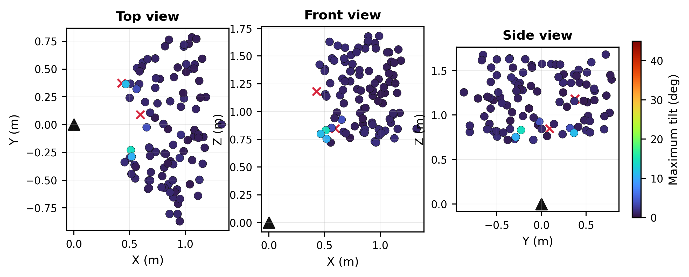
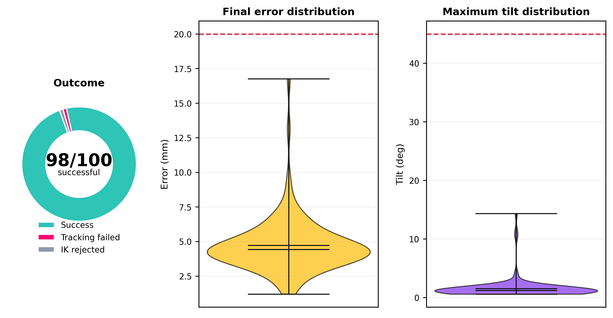
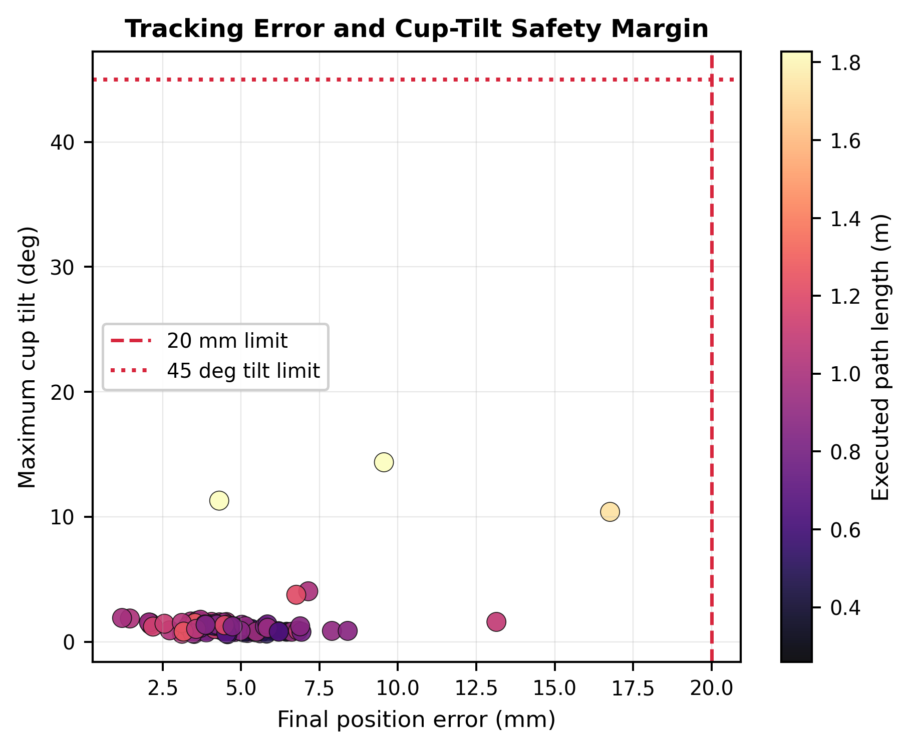
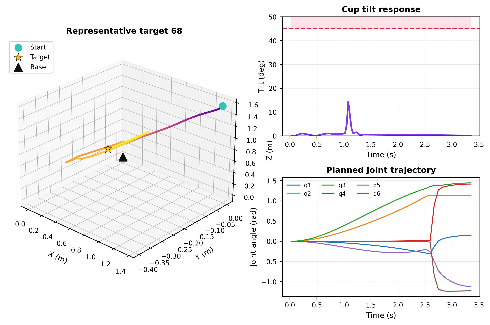
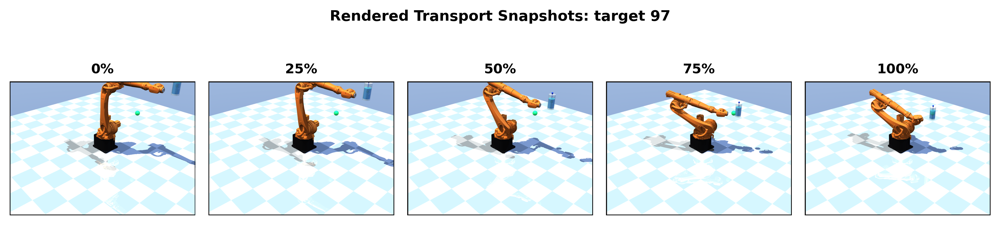

# KUKA KR20 持杯防洒运输：理论方法与仿真测试

## 1. 研究目标

本文面向机械臂末端持杯运输任务，研究 KUKA KR20 在可达空间内将一杯水运输到任意目标点时的防洒运动规划问题。任务要求末端到达给定目标位置，同时保证杯体竖直方向相对世界坐标系竖直方向的倾斜角不超过 45 度。

本项目采用刚性持握假设，即杯子与机械臂末端法兰固连，不模拟夹爪接触和真实流体动力学。该假设将研究重点集中在机械臂运动规划、末端姿态约束和动力学跟踪验证上，适合作为论文中的可复现实验平台。


## 2. 机械臂与杯体建模

仿真平台基于 MuJoCo，模型文件为 `kuka_kr20/kuka_kr20_cup_transport.xml`。原始 KUKA KR20 模型包含 6 个转动关节，本文在其基础上新增以下实验元素：

- 6 个 position actuator，分别控制 `joint_1` 至 `joint_6`。
- 末端执行器 site `ee_site`，作为任务空间位置控制点。
- 杯体 `cup_body`，包含半透明杯壁、蓝色水柱、水面和杯体竖直轴可视化元素。
- 目标点 marker，用于在仿真画面中显示命令目标位置。
- 地面、相机、光照和高分辨率离屏渲染配置，用于论文图片和动画输出。

杯体局部竖直轴通过两个 site 定义：

```text
cup_axis_base_site -> cup_axis_tip_site
```

设杯体局部竖直单位向量为：

```math
\hat{\mathbf z}_{cup}
= \frac{\mathbf p_{tip} - \mathbf p_{base}}
       {\|\mathbf p_{tip} - \mathbf p_{base}\|}
```

世界坐标系竖直方向定义为：

```math
\hat{\mathbf z}_{world} = [0, 0, 1]^T
```

则杯体倾角为：

```math
\theta =
\cos^{-1}\left(
\hat{\mathbf z}_{cup}^{T}
\hat{\mathbf z}_{world}
\right)
```

防洒约束为：

```math
\theta \leq 45^\circ
```

## 3. 约束逆运动学方法

给定目标点：

```math
\mathbf p_d = [x_d, y_d, z_d]^T
```

需要求解机械臂关节角：

```math
\mathbf q = [q_1, q_2, q_3, q_4, q_5, q_6]^T
```

使末端位置：

```math
\mathbf p_e(\mathbf q)
```

尽量接近目标点，同时保证杯体姿态接近竖直方向并满足关节限位。本文采用非线性最小二乘形式求解约束逆运动学，其残差项包括：

```math
\mathbf r_p = w_p \left(\mathbf p_e(\mathbf q) - \mathbf p_d\right)
```

```math
\mathbf r_o = w_o \left(\hat{\mathbf z}_{cup}(\mathbf q) \times \hat{\mathbf z}_{world}\right)
```

```math
\mathbf r_c = w_c \left(\mathbf q - \mathbf q_{prev}\right)
```

```math
\mathbf r_l = w_l
\frac{\mathbf q - \mathbf q_{mid}}
     {\mathbf q_{max} - \mathbf q_{min}}
```

其中，`\mathbf r_p` 表示末端位置误差，`\mathbf r_o` 表示杯体轴线与世界竖直方向的偏差，`\mathbf r_c` 用于提高轨迹连续性，`\mathbf r_l` 用于避免关节角过度接近限位。

当杯体倾角超过安全阈值时，引入软约束惩罚项：

```math
r_s =
w_s \max(0, \theta - \theta_{max})
```

综合优化问题可写为：

```math
\min_{\mathbf q}
\left\|
\begin{bmatrix}
\mathbf r_p \\
\mathbf r_o \\
\mathbf r_c \\
\mathbf r_l \\
r_s
\end{bmatrix}
\right\|_2^2
```

约束条件为：

```math
\mathbf q_{min} \leq \mathbf q \leq \mathbf q_{max}
```

该问题通过 SciPy `least_squares` 求解。每个路径点以上一个路径点的关节角为初值，从而获得连续、平滑的关节轨迹。

## 4. 轨迹生成与伺服跟踪

从初始末端位置 `\mathbf p_0` 到目标点 `\mathbf p_d` 的路径采用任务空间直线插值，并使用 cubic smoothstep 进行时间参数化：

```math
s(t) = 3t^2 - 2t^3,\quad t \in [0,1]
```

```math
\mathbf p(t) =
(1-s(t))\mathbf p_0 + s(t)\mathbf p_d
```

对每一个离散路径点求解约束逆运动学，得到期望关节轨迹：

```math
\mathbf q_d(0), \mathbf q_d(1), ..., \mathbf q_d(N)
```

MuJoCo 中通过 position actuator 跟踪该关节轨迹。仿真过程中记录：

- 末端实际位置。
- 杯体最大倾角。
- 最终位置误差。
- 关节角轨迹。
- 轨迹长度。
- 规划成功与动力学跟踪成功状态。

任务成功判据为：

```math
\|\mathbf p_e(T) - \mathbf p_d\|_2 \leq 0.02\ \text{m}
```

并且：

```math
\max_t \theta(t) \leq 45^\circ
```

## 5. 仿真测试设置

实验命令如下：

```powershell
conda activate mujoco
python src/simulate_transport.py --model kuka_kr20/kuka_kr20_cup_transport.xml --targets 100 --seed 42 --out outputs/experiment_001
python src/plot_results.py --input outputs/experiment_001/results.csv --out outputs/figures
python src/paper_figures.py --model kuka_kr20/kuka_kr20_cup_transport.xml --results outputs/experiment_001/results.csv --trajectories outputs/experiment_001/trajectories.npz --out outputs/paper_figures
```

主要参数如下：

| 参数 | 数值 |
|---|---:|
| 目标点数量 | 100 |
| 随机种子 | 42 |
| 倾角阈值 | 45 deg |
| 末端误差阈值 | 0.02 m |
| 规划路径点数 | 45 |
| MuJoCo timestep | 0.001 s |
| 默认仿真子步数 | 30 |
| 末端稳定步数 | 2000 |

目标点在机械臂前方可达空间内随机采样。每个目标点先经过约束 IK 规划，若规划成功则进入 MuJoCo 伺服跟踪验证。



## 6. 仿真结果

本次 100 个采样目标的测试结果如下：

| 指标 | 结果 |
|---|---:|
| 采样目标数 | 100 |
| IK 规划可达目标数 | 99 |
| 动力学跟踪成功目标数 | 98 |
| 可达目标跟踪成功率 | 98.99% |
| 成功样本最大最终误差 | 0.0168 m |
| 成功样本平均最终误差 | 0.0047 m |
| 成功样本最大杯体倾角 | 14.36 deg |
| 成功样本平均杯体倾角 | 1.54 deg |

结果表明，在当前采样空间和刚性持杯假设下，约束 IK 与关节伺服控制能够较稳定地完成持杯运输任务。成功样本的最大倾角为 14.36 度，明显低于 45 度安全阈值，说明该方法在防洒约束方面具有较大的安全裕度。





## 7. 代表性案例分析

下图展示了一个代表性目标点的末端三维轨迹、杯体倾角响应和规划关节角变化。可以看到，末端从初始位置平滑移动至目标点，同时杯体倾角始终远低于 45 度阈值。



进一步地，MuJoCo 渲染快照展示了持杯运输过程中的实际姿态变化。杯体与末端刚性连接，水面随杯体运动而保持在安全倾角范围内。



## 8. 图片与动画输出

论文基础图位于：

```text
outputs/figures/
```

论文补充图位于：

```text
outputs/paper_figures/
```

动画位于：

```text
outputs/animations/
outputs/animations/seamless/
```

所有论文图均同时输出 PNG 与 PDF 格式。PNG 适合预览和汇报，PDF 适合论文排版。

## 9. 方法局限性

本文当前模型采用刚性持握和倾角阈值判据，没有模拟真实液体晃动、杯口几何溢出和夹爪接触力。因此，该方法更适合作为防洒运输规划与仿真验证的基础框架。若后续需要进一步增强物理真实性，可以扩展以下方向：

- 建立液面几何模型，根据杯口半径、液面高度和加速度估计溢出风险。
- 引入夹爪模型和接触参数，验证抓取稳定性。
- 将倾角约束扩展为倾角、角速度和末端加速度的综合防洒指标。
- 使用轨迹优化或模型预测控制进一步降低动态运输过程中的液体晃动风险。

