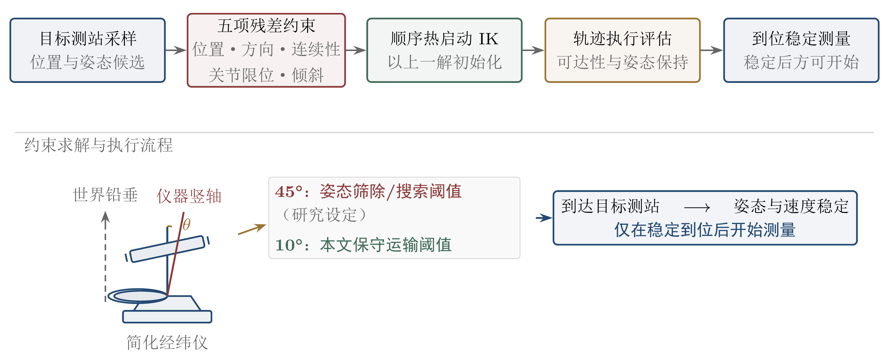
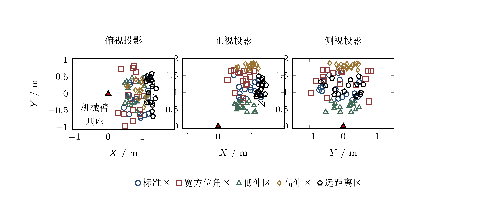
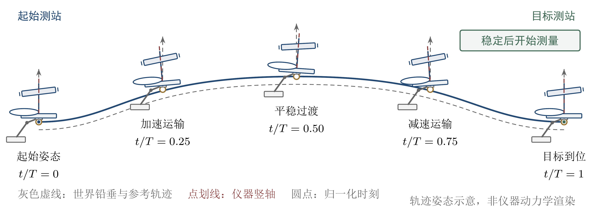
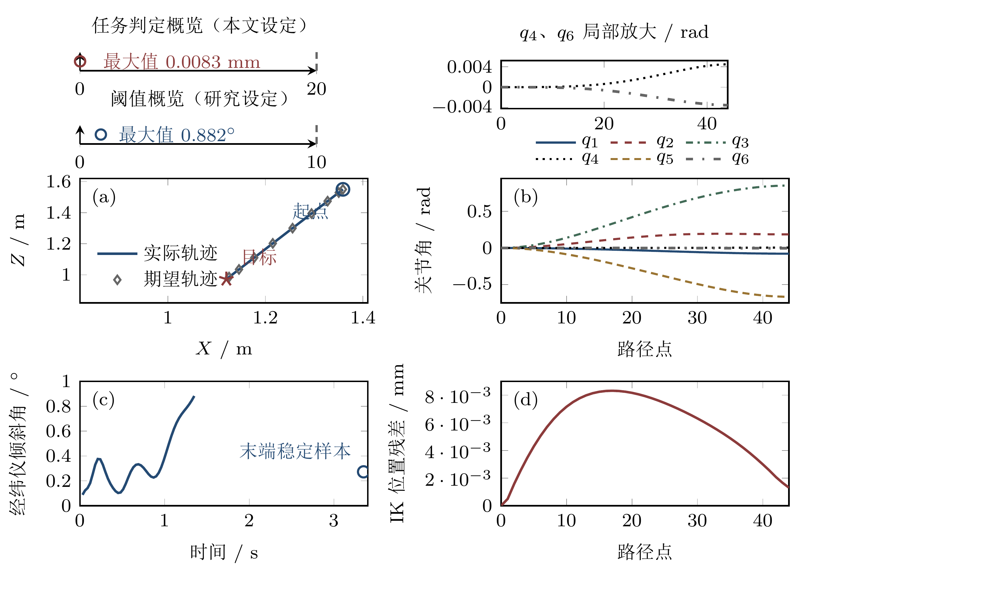
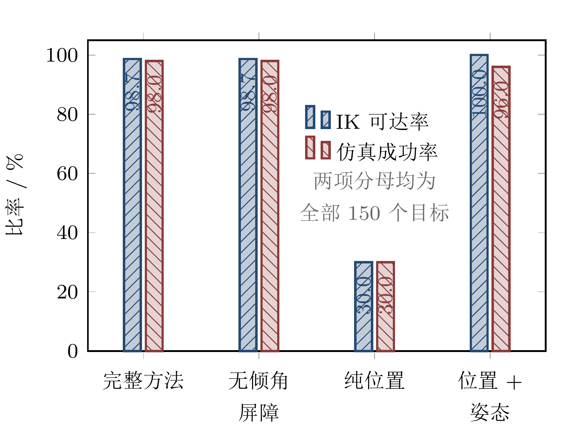
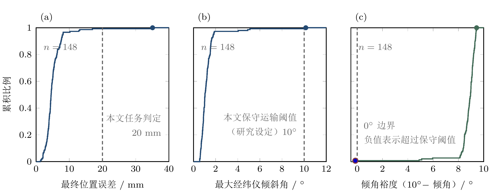
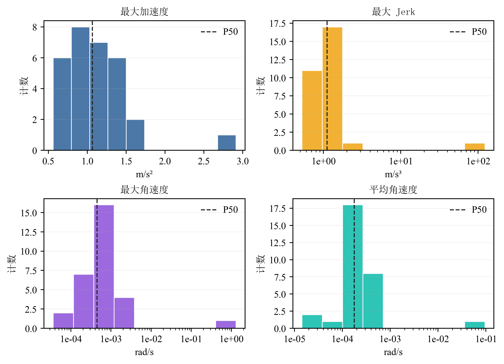
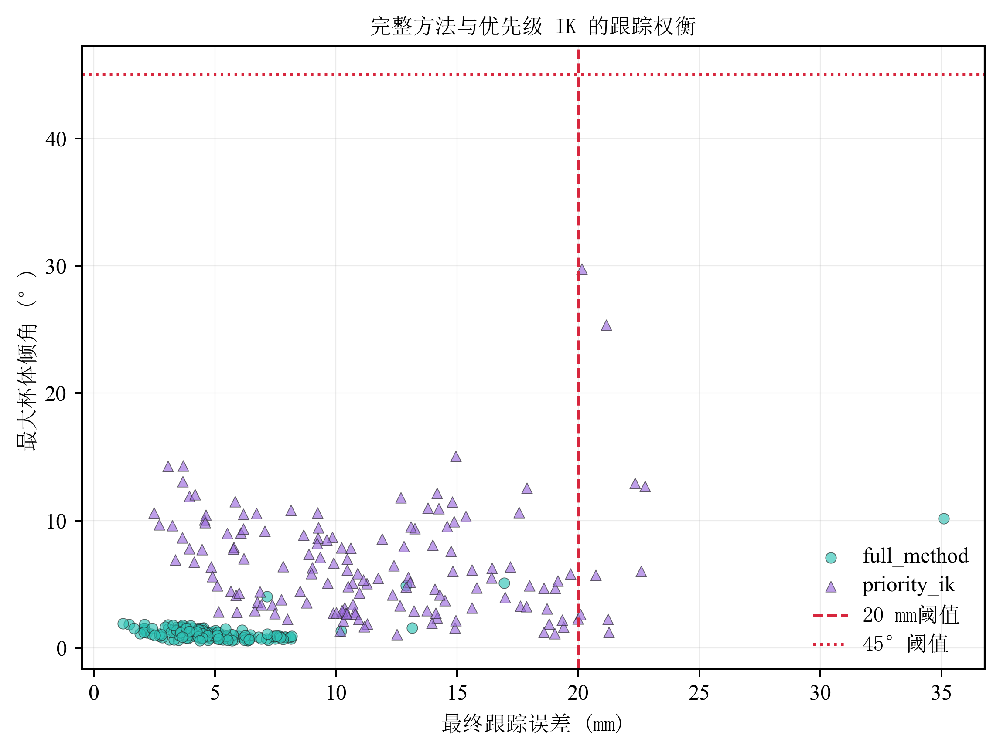

# 面向经纬仪测站转移的机械臂约束逆运动学与姿态保持研究

## 摘要

针对机械臂将经纬仪由初始位姿转移至目标测站时兼顾到位位置与竖轴姿态的问题，本文以 KUKA KR20 末端刚性负载代理为对象，构建位置、经纬仪竖轴姿态、运动连续性、关节限位中心化和倾角软屏障的联合残差，并采用有界非线性最小二乘逐路径点求解。3 个随机种子、150 个目标的消融实验表明，完整方法的仿真成功率为 98.0%；相同目标上的优先级逆运动学为 94.0%，匹配 McNemar 检验得 $p=0.03125$。完整方法在 148 条实际执行且数值有限的任务（含 1 条仿真失败）中的平均到位误差和平均最大倾角分别为 5.11 mm 和 1.23°。五区域测试、24 个权重水平扫描以及 30 个任务的动态扰动代理指标进一步给出了方法的工作范围。本文结论仅适用于当前仿真、目标分布与位置伺服条件：经纬仪只在机械臂到达目标位姿并稳定后测量，运动期间的倾角不是在线测量误差；模型也未包含具体仪器质量与惯量、真实标定或倾角到测角误差的映射。

**关键词：** 经纬仪；测站转移；约束逆运动学；姿态保持；机械臂；MuJoCo

## 1 研究目标与引言

工程测量中的测站转移通常要求仪器在新测站获得合适的位置与近似竖直的初始姿态，随后再完成稳定、整平和测量。若由机械臂承担转移，规划器不仅要把末端送至目标位置，还要在沿途抑制经纬仪竖轴的姿态偏离，并处理关节限位、轨迹连续性与数值求解可行性。本文研究的是这一“运输—到位—稳定—测量”链条中的运输与到位准备阶段。经纬仪在机械臂到达目标位姿并稳定后才开始测量，因此运动期间的倾角用于描述运输姿态扰动和到位后再整平负担，不等同于在线测量误差。

既有机械臂逆运动学研究为多任务协调提供了两条主要路线：一类采用严格任务优先级或层级优化，另一类将多个任务写入带权目标函数。前者能够明确高低优先级关系，后者实现直接且便于结合非线性边界。然而，对测站转移而言，位置、竖轴姿态、关节连续性与关节限位如何共同影响规划可达性和仿真执行结果，仍需在统一目标集上进行失败样本也计入分母的对照评估。

本文以 KUKA KR20 末端刚性负载代理的测站转移任务为对象，将位置、经纬仪竖轴姿态、连续性、关节限位和倾角软屏障写成联合残差。研究不主张每一项残差在所有工况下均有独立贡献，而是通过 150 目标消融、优先级 IK 匹配对比、五区域测试、权重扫描、动态扰动代理指标和求解器统计，识别当前实现的有效范围与失效模式。完整工作流见图1。



本文的主要工作包括：

1. 构建五项联合残差的有界非线性最小二乘模型，并给出逐路径点热启动求解与固定时长平滑插值方法；
2. 在 3 个随机种子和 150 个目标上比较四种残差配置，并在相同目标上与优先级 IK 进行匹配统计检验；
3. 报告五类工作空间、24 个单权重水平、30 个动态代理任务以及全部规划与仿真失败，避免只对成功样本作总体结论；
4. 明确研究边界：45° 是本文算法搜索使用的粗粒度机械安全上限，10° 是本文保守运输姿态阈值，20 mm 是任务特定位置判据；三者均不是仪器性能规范。

## 2 相关工作

### 2.1 约束逆运动学与优先级逆运动学

任务优先级逆运动学通过零空间投影或层级优化，在满足高优先级任务后处理次级目标 [Chiaverini, 1997]。Baerlocher 与 Boulic 将其扩展到任意数量的严格优先级，Escande 等采用层级二次规划实现快速在线运动生成 [Baerlocher and Boulic, 2004; Escande et al., 2014]。本文方法与这些工作解决相同的多任务协调问题，但采用软权重联合残差，不提供严格的任务优先级保证。为避免只与自身消融比较，本文另实现“位置优先、竖轴姿态次之”的优先级 IK 基线。

### 2.2 数值逆运动学与关节约束

阻尼最小二乘通过在伪逆近似中引入阻尼，提高奇异位形附近的数值稳定性 [Buss, 2004]。零空间饱和法则面向冗余机器人处理硬关节约束 [Flacco et al., 2015]。本文使用 SciPy `least_squares` 的信赖域反射算法直接求解带关节上下界的非线性最小二乘问题，优点是残差组合和边界实现简洁，限制是软残差之间可能发生权衡，且局部收敛依赖初值。

### 2.3 机器人测量的姿态准备

机器人辅助测量可将传感器搬运、位姿准备与后续测量组织为连续流程。对于经纬仪测站转移，运输阶段的目标不是在运动中完成测量，而是将仪器送至目标测站，并为停止后的稳定与整平提供较好的初始姿态。基于这一任务定义，本文仅把竖轴倾角作为运输姿态与到位准备指标，不把它换算为测量结果，也不声称改善了具体测量性能。由于现稿没有经核验的机器人经纬仪文献，本节只界定问题类别，不补入未经核验的具体引用。

### 2.4 轨迹时间参数化

路径时间参数化需要在速度和加速度等约束下确定执行时序。Kunz 与 Stilman研究了有界速度和加速度下的时间最优轨迹生成，TOPP-RA 则通过可达性分析处理一类广义二阶约束 [Kunz and Stilman, 2012; Pham and Pham, 2018]。本文仅使用三次平滑步进完成固定时长插值，不进行时间最优化，因此动态指标反映当前时序设定，而非可达到的最优动态性能。

## 3 系统与刚性负载代理模型

### 3.1 仿真系统

仿真平台采用 MuJoCo，主体为 6 自由度 KUKA KR20，使用 6 个位置执行器跟踪规划关节轨迹。末端执行器位姿由 site 表示，仪器代理与末端刚性连接，目标点 marker 仅用于可视化。该模型用于验证位置伺服假设下的运动学轨迹，不是经标定的真实经纬仪模型；模型未给出具体仪器质量、惯量、夹持柔顺性或真实几何参数。

仓库中的模型文件及部分代码标识符采用历史遗留命名，其具体名称仅在第 15 节复现说明和命令中保留。本文将模型中的末端对象解释为简化刚性负载代理，而非真实经纬仪的标定几何与惯性模型。

### 3.2 经纬仪竖轴与倾角

以代理模型上竖轴基点和端点的位置分别记为 $\mathbf p_{base}$ 和 $\mathbf p_{tip}$，经纬仪竖轴单位向量定义为

```math
\hat{\mathbf z}_{inst}
= \frac{\mathbf p_{tip}-\mathbf p_{base}}
       {\|\mathbf p_{tip}-\mathbf p_{base}\|}.
```

相对世界竖直方向 $\hat{\mathbf z}_{world}=[0,0,1]^T$ 的倾角为

```math
\theta=\cos^{-1}\!\left(
\hat{\mathbf z}_{inst}^{T}\hat{\mathbf z}_{world}
\right).
```

本文默认将 45° 设为算法搜索中的粗粒度机械安全上限，用于排除严重姿态偏离；该数值是研究设定，不是外部规范。结果报告主要以 10° 作为保守运输姿态阈值，同样只是研究设定，不代表任何具体仪器的工作容差。运动期间的 $\theta$ 只反映姿态扰动；到位并稳定后的测量性能不在本模型中计算。

## 4 约束逆运动学方法

### 4.1 问题形式化

给定目标位置 $\mathbf p_d$，求关节角 $\mathbf q=[q_1,\ldots,q_6]^T$，使末端位置 $\mathbf p_e(\mathbf q)$ 接近目标，同时维持经纬仪竖轴姿态、相邻路径点连续性并远离关节限位。综合目标为

```math
\min_{\mathbf q}
\left\|
\begin{bmatrix}
\mathbf r_p\\
\mathbf r_o\\
\mathbf r_c\\
\mathbf r_l\\
r_s
\end{bmatrix}
\right\|_2^2,
\quad
\mathbf q_{min}\leq\mathbf q\leq\mathbf q_{max}.
```

### 4.2 残差设计

**表1 约束 IK 的残差、默认权重与作用**

| 残差 | 公式 | 权重 | 作用 |
|---|---|---:|---|
| 位置误差 $\mathbf r_p$ | $7.5(\mathbf p_e-\mathbf p_d)$ | 7.5 | 减小末端到位误差 |
| 竖轴姿态 $\mathbf r_o$ | $0.90(\hat{\mathbf z}_{inst}\times\hat{\mathbf z}_{world})$ | 0.90 | 抑制经纬仪竖轴偏离 |
| 运动连续性 $\mathbf r_c$ | $0.08(\mathbf q-\mathbf q_{prev})$ | 0.08 | 减小相邻路径点关节突变 |
| 关节限位中心化 $\mathbf r_l$ | $0.025(\mathbf q-\mathbf q_{mid})/(\mathbf q_{max}-\mathbf q_{min})$ | 0.025 | 远离关节上下界 |
| 倾角软屏障 $r_s$ | $18.0\max(0,\theta-\theta_{max})$ | 18.0 | 超过研究设定上限后增加惩罚 |

参数来源为 `src/planner.py` 和 `src/baseline_comparison.py`。姿态残差使用叉积，是因为其在小倾角附近连续且便于数值求导；当 $\theta\rightarrow\pi$ 时叉积会再次趋近零，因此不能用于完整倒置附近的姿态判别。本文算法搜索限于 $\theta<\pi/2$，不覆盖该奇异区域。连续性残差相当于一阶关节平滑正则项，限位残差用于保留关节运动余量，倾角屏障则是可违反的软惩罚而非硬约束。各项的独立作用由消融实验检验。

### 4.3 数值求解与判据

本文采用 SciPy `least_squares` 的信赖域反射算法，设置 `xtol=1e-5`、`ftol=1e-5`、`gtol=1e-5` 和 `max_nfev=120`。每个路径点以上一路径点解为初值，并显式施加关节上下界。`max_nfev` 是单路径点调用上限，不应与整条 45 路径点轨迹的累计函数评估次数混淆。

任务成功需满足终点位置误差不超过 20 mm，并满足仿真执行判据。20 mm 是本目标集的任务特定位置判据，不代表通用工程测量或装配公差。倾角报告同时给出实际值与相对 10° 保守运输姿态阈值的裕度；45° 仅作为算法搜索的粗粒度机械安全上限。

## 5 实验设计与评价原则

主要消融包含 3 个随机种子、每个种子 50 个目标和 4 种残差配置，共 600 次规划—仿真记录。外部基线使用相同的 3 个随机种子与 150 个目标。权重灵敏度在 30 个固定目标上扫描 24 个水平；扩展工作空间包含 5 个区域、每区 16 个目标；动态代理统计使用 30 个任务。

所有成功率均以预定目标总数为分母，规划失败和仿真失败均保留。到位误差、最大倾角与动态量用于描述当前仿真条件下的轨迹和执行表现，不外推为真实仪器的测量性能。经纬仪只在到位并稳定后测量，本文没有建立运输倾角与测量结果之间的映射。

## 6 五区域工作空间测试

### 6.1 区域定义

为覆盖不同半径、方位角和高度，将目标测站划分为标准、宽方位角、低伸、高伸和远距离五类。其空间投影见图2，采样范围见表2。



**表2 扩展工作空间的五类采样区域**

| 区域 | 半径范围（m） | 方位角范围（rad） | 高度范围（m） | 设定难度 |
|---|---|---|---|---|
| 标准 | 0.55–1.35 | -0.78–0.78 | 0.70–1.70 | 基准 |
| 宽方位角 | 0.55–1.20 | -1.20–1.20 | 0.70–1.70 | 中 |
| 低伸 | 0.55–1.20 | -0.60–0.60 | 0.40–0.75 | 中—高 |
| 高伸 | 0.55–1.20 | -0.50–0.50 | 1.65–1.90 | 高 |
| 远距离 | 1.15–1.50 | -0.50–0.50 | 0.80–1.50 | 最高 |

采样实现位于 `src/enhanced_experiments.py` 的 `sample_targets_expanded`。

### 6.2 区域结果

**表3 五类工作空间的规划与仿真结果**

| 区域 | 总数 | 规划成功 | 仿真成功 | 规划成功率 | 仿真成功率 |
|---|---:|---:|---:|---:|---:|
| 远距离 | 16 | 16 | 16 | 100.0% | 100.0% |
| 高伸 | 16 | 16 | 16 | 100.0% | 100.0% |
| 低伸 | 16 | 16 | 16 | 100.0% | 100.0% |
| 标准 | 16 | 16 | 15 | 100.0% | 93.75% |
| 宽方位角 | 16 | 16 | 16 | 100.0% | 100.0% |

数据来自 `outputs/round2_experiments/expanded_workspace_summary.csv`。五个区域的规划成功率均为 100.0%，其中四个区域的仿真成功率为 100.0%；标准区出现 1 次失败。该结果说明当前样本中的失败不能仅按预设几何难度解释，也可能与具体目标、初值或仿真跟踪有关。由于每区仅有 16 个目标，区域结果用于暴露覆盖范围，不支持对未采样工作空间作普遍化结论。

## 7 轨迹生成与代表性任务

### 7.1 轨迹时间参数化

从初始位置 $\mathbf p_0$ 到目标位置 $\mathbf p_d$ 采用任务空间直线插值和三次平滑步进：

```math
s(t)=3t^2-2t^3,\quad t\in[0,1],
```

```math
\mathbf p(t)=(1-s(t))\mathbf p_0+s(t)\mathbf p_d.
```

其中 $t$ 为归一化时间。每条轨迹离散为 45 个路径点并顺序求解 IK。图3以五个阶段概括机械臂从初始持有、抬升与转移、接近目标、到位保持直至稳定后测量的流程。运动阶段只评价位置与姿态准备，不执行经纬仪测量。



### 7.2 代表性任务

代表性任务的末端轨迹、关节角、经纬仪倾角与逐路径点 IK 位置残差见图4。该图用于展示单条轨迹内部各量的时间关系，不替代后续基于全部目标的成功率与分布统计。



## 8 消融研究

### 8.1 残差配置

**表4 默认消融实验的残差开关与权重**

| 变体 | 位置 | 姿态 | 倾角屏障 | 连续性 | 限位中心化 |
|---|---|---|---|---|---|
| 完整方法 | ✓（7.5） | ✓（0.90） | ✓（18.0） | ✓（0.08） | ✓（0.025） |
| 无倾角屏障 | ✓ | ✓ | ✗ | ✓ | ✓ |
| 纯位置 | ✓ | ✗ | ✗ | ✗ | ✗ |
| 位置+姿态 | ✓ | ✓（0.90） | ✗ | ✗ | ✗ |

配置来源为 `src/baseline_comparison.py` 中的 `ABLATION_VARIANTS`。

### 8.2 主要结果

**表5 默认权重下四种消融变体的规划与仿真结果**

| 变体 | IK 规划 | 仿真成功 | 成功率 | 结果解释 |
|---|---:|---:|---:|---|
| 完整方法 | 148/150 | 147/150 | 98.0% | 当前联合残差配置 |
| 无倾角屏障 | 148/150 | 147/150 | 98.0% | 默认条件下屏障未产生可见差异 |
| 纯位置 | 45/150 | 45/150 | 30.0% | 主要损失来自规划可达性 |
| 位置+姿态 | 150/150 | 144/150 | 96.0% | 少量目标出现位置—姿态权衡失败 |

数据来自 `outputs/ablation_study/ablation_summary.csv`，采集日期为 2026-06-04。图5并列展示 IK 可达率和包含失败样本的仿真成功率。



完整方法与无倾角屏障变体均规划成功 148/150、仿真成功 147/150。所有实际执行任务中，完整方法的平均最大倾角和全局峰值分别为 1.23° 和 10.15°，远低于默认 45° 激活上限，因此本结果不支持软屏障在常规工况下具有独立增益。

纯位置变体只对 45/150 个目标生成可行规划，但这 45 条轨迹全部通过仿真。因而准确解释是缺少其他残差时规划可达空间显著收窄，而不是已规划轨迹更易跟踪失败。位置+姿态变体实现 150/150 的 IK 可达率和 144/150 的仿真成功；6 条失败记录中的最大倾角为 15.12°。全部 150 条实际执行记录的最大倾角为 23.18°，但该值出现在仿真成功记录中，不能作为失败证据。现有结果表明省略连续性和限位中心化后仍有少量目标未同时满足仿真判据，但不能把差异归因于某一个被同时移除的残差，也不能仅按最大倾角解释失败。

完整方法的位置误差、最大倾角及相对 10° 阈值的姿态裕度见图6。图中 10° 仅是本文保守运输姿态报告参考，不是具体经纬仪的性能界限。



### 8.3 10°收紧阈值实验

为增加软屏障进入激活区的可能性，将 `tilt_limit_deg` 从 45° 收紧为 10°，其余条件与表5一致。每个变体仍使用 3 个随机种子和 50 个目标，共 300 次实验。

**表6 10°阈值下两种屏障配置的消融结果**

| 变体 | IK 可达 | 仿真成功 | 平均最大倾角（°） | 全局最大倾角（°） |
|---|---:|---:|---:|---:|
| `full_tight10` | 148/150 | 147/150（98.0%） | 1.23 | 10.15 |
| `no_barrier_tight10` | 148/150 | 147/150（98.0%） | 1.23 | 10.15 |

数据来自 `outputs/ablation_study_tight10/ablation_summary.csv`。两种配置的规划峰值倾角均为 5.14°，仍低于 10°，所以规划中的软屏障实际没有激活；仿真执行峰值却达到 10.15°。因此，这一收紧实验仍未证明屏障的独立贡献，只表明规划轨迹的小倾角不能保证位置伺服执行时不超过同一参考值。若要量化屏障激活后的效应，需要采用低于 5.14° 的规划阈值或更具挑战性的目标集。

## 9 权重灵敏度

### 9.1 单权重扫描

在 30 个固定目标上，对每个参数在默认值上下选取 4–5 个水平，并同时评价 IK 规划和 MuJoCo 跟踪。

**表7 单权重扫描中的 IK 与仿真成功率范围**

| 参数 | 扫描范围 | IK 成功率 | 仿真成功率 | 观察 |
|---|---|---:|---:|---|
| `position_weight` | 3.0–30.0 | 96.7%–100.0% | 96.7%–96.7% | 仿真层稳定 |
| `orientation_weight` | 0.10–3.60 | 96.7%–100.0% | 96.7%–100.0% | 高权重时 IK 略降 |
| `tilt_barrier_weight` | 5.0–72.0 | 100.0%–100.0% | 96.7%–96.7% | 扫描范围内无变化 |
| `continuity_weight` | 0.01–0.32 | 100.0%–100.0% | 96.7%–100.0% | 高权重时仿真率略升 |
| `limit_weight` | 0.005–0.10 | 100.0%–100.0% | 96.7%–96.7% | 扫描范围内无变化 |

数据来自 `outputs/round2_experiments/sensitivity_sim_summary.csv`（24 个权重水平×30 个目标）。除 `position_weight=3.0` 以及 `orientation_weight=1.80–3.60` 外，各水平的 IK 成功率均为 100.0%；所有仿真成功率均不低于 96.7%。`orientation_weight` 从 0.90 提高至 1.80–3.60 时，IK 成功率降至 96.7%，与位置和姿态残差之间的权衡相符，但数据不足以确定单一原因。

IK 层与仿真层的响应并不完全一致：`position_weight=3.0` 时 IK 成功率下降，但仿真率与其他水平相同；`orientation_weight=0.10` 时仿真率达到 100.0%；`continuity_weight=0.16` 和 0.32 时，仿真率从 96.7% 提高到 100.0%，而 IK 始终为 100.0%。默认权重 7.5/0.90/18.0/0.08/0.025 可作为本文目标分布的初始工作点，迁移到其他机器人、负载或任务判据时需重新扫描。

## 10 动态扰动代理指标

### 10.1 定义

除竖轴倾角外，本文以末端加速度、加加速度和倾角变化率描述运输期间的动态扰动。它们是轨迹层代理量，用于识别可能增加到位稳定负担的样本，不是测量误差或仪器内部动态模型。有限差分定义为

```math
\mathbf v_k=\frac{\mathbf p_{k+1}-\mathbf p_k}{\Delta t},\qquad
\mathbf a_k=\frac{\mathbf v_{k+1}-\mathbf v_k}{\Delta t},
```

```math
\mathbf j_k=\frac{\mathbf a_{k+1}-\mathbf a_k}{\Delta t},\qquad
\omega_k=\frac{|\theta_{k+1}-\theta_k|}{\Delta t}.
```

### 10.2 30任务结果

**表8 30个目标的动态扰动代理指标分布**

| 统计量 | 最大加速度（m/s²） | 最大加加速度（m/s³） | 最大角速度（rad/s） | 平均角速度（rad/s） |
|---|---:|---:|---:|---:|
| 均值 | 1.134 | 4.785 | 0.03969 | 0.003079 |
| P50 | 1.065 | 1.117 | 0.00045 | 0.000178 |
| P95 | 1.701 | 1.782 | 0.00184 | 0.000508 |

数据来自 `outputs/round2_experiments/dynamic_metrics_results.csv`。成功任务的指标分布见图7。



`planned_max_tilt_deg`（规划轨迹静态最大倾角）与最大加速度的 Pearson 相关系数为 0.75；该规划指标与最大加加速度、最大角速度的相关系数均接近 1.00，但后二者主要由一个最大加加速度为 110.9 m/s³ 的异常目标驱动。这些相关性没有使用 `sim_max_tilt_deg`，因此不能解释为仿真执行最大倾角与动态量的相关关系。以水平半径中位数 1.033 m 分组，近距组的平均最大加速度和最大加加速度分别为 1.282 m/s² 和 8.535 m/s³，高于远距组的 0.987 m/s² 和 1.034 m/s³。30 条规划轨迹均满足 45° 搜索上限且对应仿真成功，但动态代理仍识别出异常样本，说明较小的规划静态倾角不足以单独表征运输动态扰动。

## 11 外部基线比较

### 11.1 匹配目标结果

优先级 IK 先求解位置任务，再把竖轴姿态任务投影至位置 Jacobian 的零空间。两种方法采用相同的 3 个随机种子和 150 个目标。

**表9 本文方法与优先级 IK 的匹配目标比较**

| 方法 | IK 可达率 | 仿真成功率 | 平均到位误差（mm） | 平均最大倾角（°） | 平均规划时间（s） |
|---|---:|---:|---:|---:|---:|
| `full_method`（本文） | 98.7% | 98.0% | 5.11 | 1.23 | 0.182 |
| `priority_ik` | 100.0% | 94.0% | 11.42 | 6.45 | 0.037 |

数据来自 `outputs/ablation_study/ablation_summary.csv` 和 `outputs/external_baselines/priority_ik_summary.csv`。误差与倾角均值的统计总体并不等长：本文方法按 148 条实际执行且数值有限的记录计算，其中包含 1 条仿真失败；优先级 IK 按全部 150 条实际执行且数值有限的记录计算，其中包含 9 条仿真失败。两种方法的规划时间均按 150 次规划记录统计。优先级 IK 使用显式伪逆，平均规划时间为 0.037 s，低于联合残差方法的 0.182 s；其平均到位误差和平均最大倾角分别为 11.42 mm 和 6.45°，高于本文方法的 5.11 mm 和 1.23°。匹配成功状态为 141 个目标两者均成功、6 个仅本文方法成功、0 个仅优先级 IK 成功、3 个两者均失败。精确双侧 McNemar 二项检验得 $p=0.03125$，支持当前匹配样本中本文方法具有更高仿真成功率。图8按相同目标编号组织两种方法的实际执行且数值有限记录；失败点保留，本文方法的 2 条无有限执行值记录不进入散点，但仍计入成功率分母。



该对比同时揭示了速度—性能权衡：优先级 IK 的规划更快，联合残差方法在当前仿真中具有较低到位误差和运输倾角。4 个百分点的成功率差异不能单独归因于某一残差，连续性与限位中心化的独立效应仍需额外因子实验。

## 12 收敛与失效模式

### 12.1 求解器统计

`outputs/ablation_study/full_method_results.csv` 包含完整方法的 150 次规划记录，每条轨迹含 45 个路径点。

**表10 完整方法的函数评估次数与规划时间**

| 指标 | 最小值 | 均值 | P50 | P95 | 最大值 | 标准差 |
|---|---:|---:|---:|---:|---:|---:|
| 每条轨迹累计函数评估次数 | 140 | 176.86 | 180 | 191 | 213 | 12.41 |
| 总规划时间（s） | 0.117 | 0.182 | 0.182 | 0.217 | 0.266 | 0.021 |

平均 0.182 s/轨迹折合约 4.05 ms/路径点。该统计表明当前实现适合上层批量轨迹生成，不支持其直接用于 500 Hz、周期 2 ms 的底层控制迭代。

### 12.2 失败样本

完整方法发生 2/150 次 IK 规划失败（1.3%）。两条轨迹的终点位置误差分别为 87.3 mm 和 104.5 mm，均超过 20 mm 的任务特定判据。现有日志不能区分几何不可达、初值敏感或局部收敛，因此不作单一归因。

在 148 个可规划目标中发生 1 次仿真失败（0.7%）。该任务的最终跟踪误差为 35.1 mm、最大倾角为 10.15°，失败由位置判据触发，而不是 45° 搜索上限。无倾角屏障变体仍为 147/150 次仿真成功，也不支持把这一失败归因于屏障缺失。

## 13 讨论

### 13.1 证据所支持的结论

在当前 KUKA KR20、刚性负载代理、目标分布和位置伺服条件下，联合残差方法取得 98.0% 的仿真成功率；3 个随机种子的成功率分别为 98.0%、96.0% 和 100.0%，均值为 98.0%±1.63%（总体标准差，数据来自 `outputs/ablation_study/full_method_results.csv`）。该方法在匹配目标上优于 94.0% 的优先级 IK；其 5.11 mm 平均到位误差和 1.23° 平均最大倾角来自 148 条实际执行且数值有限的记录（含 1 条仿真失败），而优先级 IK 的对应均值来自 150 条记录（含 9 条仿真失败）。这些结果说明多项软残差联合求解能够在当前位置判据下兼顾到位与运输姿态；五区域测试和权重扫描进一步表明，这一表现并非只出现在单一空间区域或单点权重配置。

对上述结果的合理解释是，竖轴姿态、连续性和限位正则共同改变了解空间与逐路径点热启动过程，从而减少了部分目标上的位置—姿态冲突。然而，默认消融一次移除了多项残差，不能辨识连续性与限位中心化各自的因果贡献。软屏障在 45° 和 10° 两组实验中均未激活，更不能作为当前性能差异的解释。

动态代理量补充了静态倾角没有表达的时序信息。异常最大加加速度样本表明，即使轨迹保持较小倾角且仿真成功，仍可能产生较大的到位稳定负担。但代理指标没有与真实仪器稳定时间或测量结果标定，因此只能用于筛查运输扰动，不构成仪器性能证据。

### 13.2 研究限制

- **负载模型：** 经纬仪被简化为末端刚性负载代理，没有具体仪器质量、惯量、夹具柔顺性和结构振动参数。
- **测量边界：** 仪器只在机械臂到达目标位姿并稳定后测量；本文未执行真实标定，也没有建立倾角与测量结果之间的误差模型。
- **控制假设：** 仿真采用位置执行器，不包含力矩控制、关节柔顺性和真实控制时延，可能低估实际跟踪难度。
- **规划范围：** 方法未加入障碍物、碰撞、速度、加速度和稳定时间的硬约束，三次时间缩放也不是时间最优参数化。
- **阈值性质：** 45°、10° 和 20 mm 均为本文研究设定或任务判据，不应外推为通用仪器或工程规范。
- **样本范围：** 结论来自单一 6 自由度机械臂、给定初始位姿和有限目标集；五区域每区 16 个目标，不能覆盖全部工作空间。

迁移到 7 自由度机械臂时，可将限位正则改写为零空间目标并重新扫描姿态与连续性权重；迁移到力矩控制系统时，应先重复表5的消融并加入执行器与负载参数；移动机械臂还需将底座位姿和稳定性纳入决策变量。进一步验证软屏障需要设置能够实际进入激活区的目标或阈值，并单独控制其他残差。

## 14 结论

本文面向 KUKA KR20 末端刚性负载代理的经纬仪测站转移，构建了位置、经纬仪竖轴姿态、连续性、关节限位和倾角软屏障联合残差，并通过有界非线性最小二乘逐路径点生成轨迹。150 目标消融表明完整方法的仿真成功率为 98.0%；与优先级 IK 的匹配比较得到 98.0% 对 94.0% 和 $p=0.03125$。完整方法 148 条实际执行且数值有限记录（含 1 条仿真失败）的平均到位误差与平均最大倾角为 5.11 mm 和 1.23°。五区域、权重扫描、动态代理和失败样本统计共同限定了这一结论的适用范围。

本文支持的工程含义是：该方法可在当前仿真条件下为测站转移提供较低到位误差和较小运输倾角，从而给出较好的到位测量准备初始姿态。它不证明具体仪器测量性能的改善；经纬仪只在到位稳定后测量，真实质量惯量、标定关系、控制动态和运输姿态到测量结果的映射仍需实物实验建立。

## 15 实验复现

以下命令和模型路径保持仓库历史命名，仅用于复现实验。历史文件 `kuka_kr20/kuka_kr20_cup_transport.xml` 在本文中作为简化刚性负载代理，不代表经标定的经纬仪几何或惯性模型。

```powershell
conda activate mujoco

# 原始实验
python src/simulate_transport.py --model kuka_kr20/kuka_kr20_cup_transport.xml --targets 100 --seed 42 --out outputs/experiment_001

# 消融实验
python src/baseline_comparison.py --targets 50 --seeds 3 --out outputs/ablation_study

# 增强实验（Round 2）
python src/enhanced_experiments.py --mode all --targets 50 --seeds 10 --out outputs/round2_experiments
python src/enhanced_experiments.py --mode sensitivity --targets 30 --with-sim --out outputs/round2_experiments
python src/enhanced_experiments.py --mode expanded --targets 80 --out outputs/round2_experiments
python src/enhanced_experiments.py --mode dynamic --targets 30 --out outputs/round2_experiments

# 可视化
python src/plot_results.py --input outputs/experiment_001/results.csv --out outputs/figures
python src/paper_figures.py --model kuka_kr20/kuka_kr20_cup_transport.xml --results outputs/experiment_001/results.csv --trajectories outputs/experiment_001/trajectories.npz --out outputs/paper_figures
```

## 16 参考文献

[Chiaverini, 1997] S. Chiaverini, "Singularity-robust task-priority redundancy resolution for real-time kinematic control of robot manipulators," *IEEE Transactions on Robotics and Automation*, vol. 13, no. 3, pp. 398–410, 1997. DOI: 10.1109/70.585902.

[Baerlocher and Boulic, 2004] P. Baerlocher and R. Boulic, "An inverse kinematics architecture enforcing an arbitrary number of strict priority levels," *The Visual Computer*, vol. 20, no. 6, pp. 402–417, 2004. DOI: 10.1007/s00371-004-0244-4.

[Escande et al., 2014] A. Escande, N. Mansard, and P.-B. Wieber, "Hierarchical quadratic programming: Fast online humanoid-robot motion generation," *The International Journal of Robotics Research*, vol. 33, no. 7, pp. 1006–1028, 2014. DOI: 10.1177/0278364914521306.

[Buss, 2004] S. R. Buss, "Introduction to inverse kinematics with Jacobian transpose, pseudoinverse and damped least squares methods," University of California, San Diego, Tech. Rep., 2004.

[Flacco et al., 2015] F. Flacco, A. De Luca, and O. Khatib, "Control of redundant robots under hard joint constraints: Saturation in the null space," *IEEE Transactions on Robotics*, vol. 31, no. 3, pp. 637–654, 2015. DOI: 10.1109/TRO.2015.2418582.

[Kunz and Stilman, 2012] T. Kunz and M. Stilman, "Time-optimal trajectory generation for path following with bounded acceleration and velocity," in *Robotics: Science and Systems VIII*, 2012. DOI: 10.15607/RSS.2012.VIII.027.

[Pham and Pham, 2018] H. Pham and Q.-C. Pham, "A new approach to time-optimal path parameterization based on reachability analysis," *IEEE Transactions on Robotics*, vol. 34, no. 3, pp. 645–659, 2018. DOI: 10.1109/TRO.2018.2819195.
